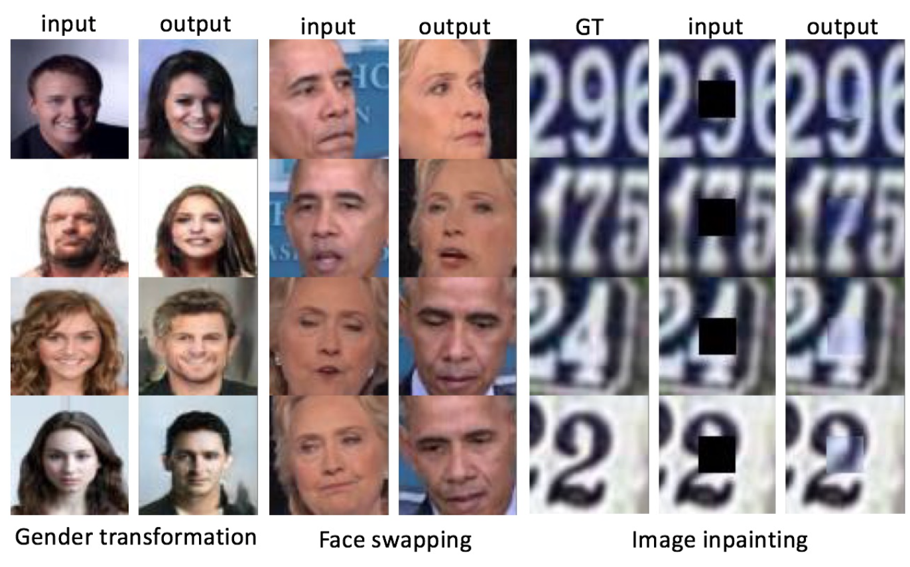
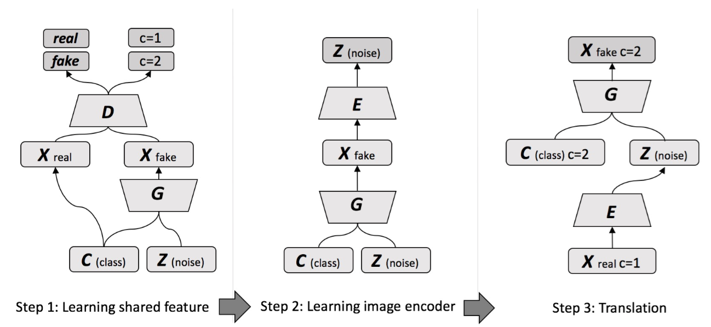

## Unsupervised Image to Image Translation with Generative Adversarial Networks

<a href="http://tensorlayer.readthedocs.io">
<div align="center">
	
</div>
</a>

##### Paper: [Unsupervised Image to Image Translation with Generative Adversarial Networks](https://arxiv.org/abs/1701.02676)

### Requirements
* TensorFlow 1.0.0
* TensorLayer 1.3.11
* CUDA 8
* Ubuntu

### Dataset
* Before training the network, please prepare the data
* CelebA [download](http://mmlab.ie.cuhk.edu.hk/projects/CelebA.html)
* Cropped SVHN [download](http://ufldl.stanford.edu/housenumbers/)
* MNIST [download](https://github.com/myleott/mnist_png/blob/master/mnist_png.tar.gz), and put to `data/mnist_png`

### Usage

#### Step 1: Learning shared feature
```
python3 train.py --train_step="ac_gan" --retrain=1
```
#### Step 2: Learning image encoder
```
python3 train.py --train_step="imageEncoder" --retrain=1
```
#### Step 3: Translation
```
python3 translate_image.py
```
* Samples of all steps will be saved to data/samples/

### Network
<a href="http://tensorlayer.readthedocs.io">
<div align="center">
	
</div>
</a>

#### Want to use different datasets?
* in `train.py` and `translate_image.py` modify the name of dataset `flags.DEFINE_string("dataset", "celebA", "The name of dataset [celebA, obama_hillary]")`
* write your own `data_loader` in `data_loader.py`


